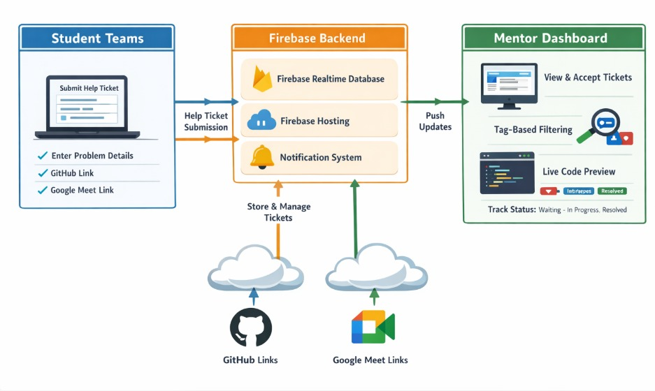
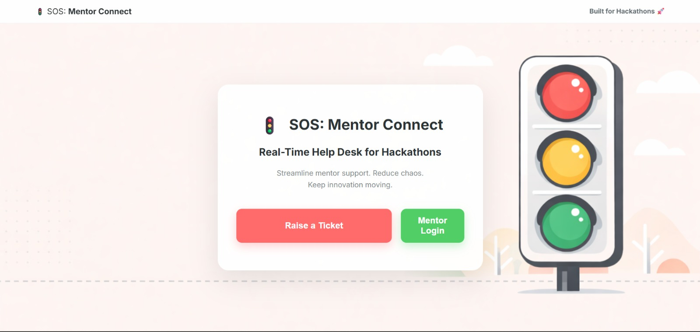
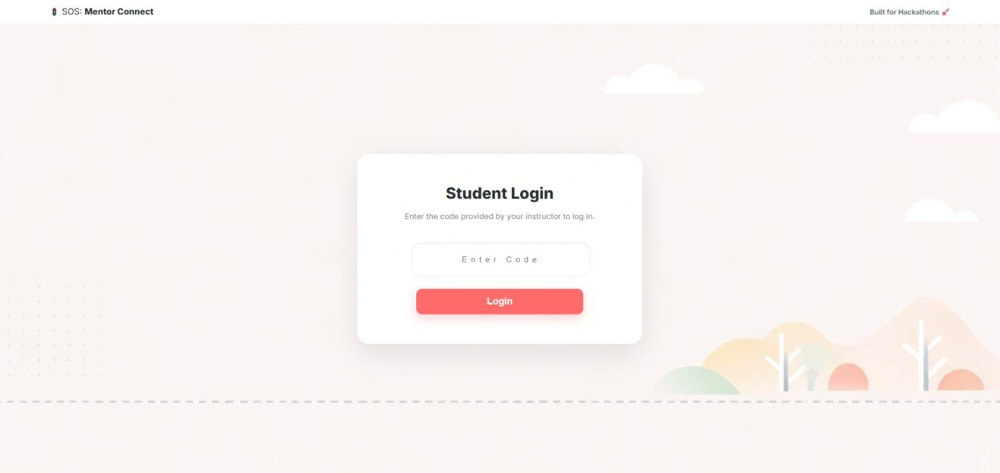
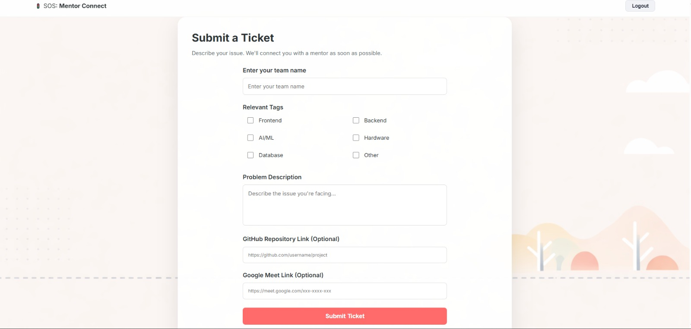
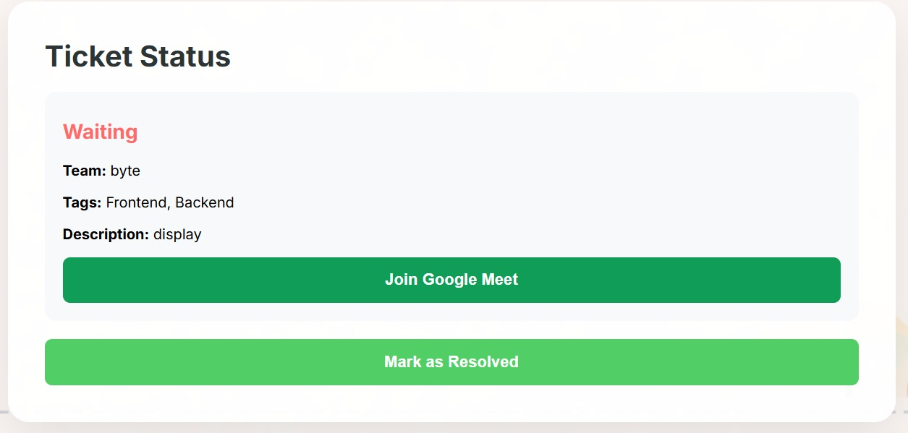
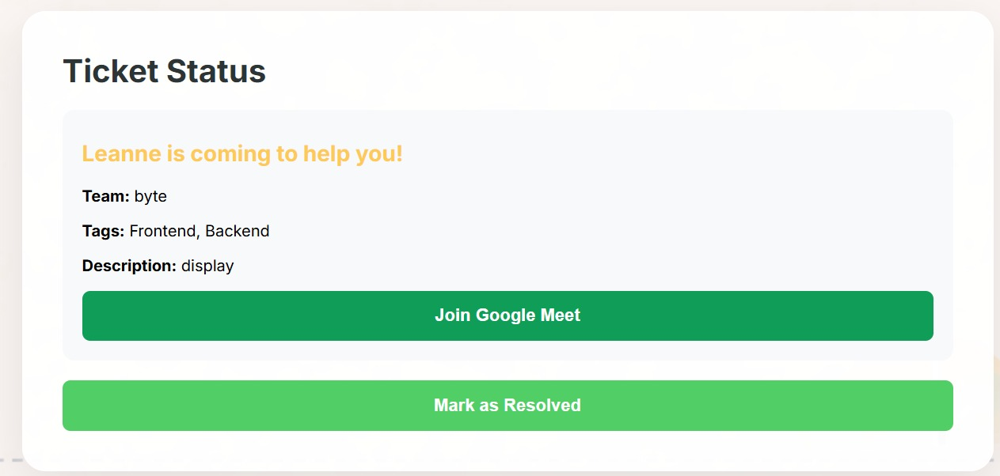
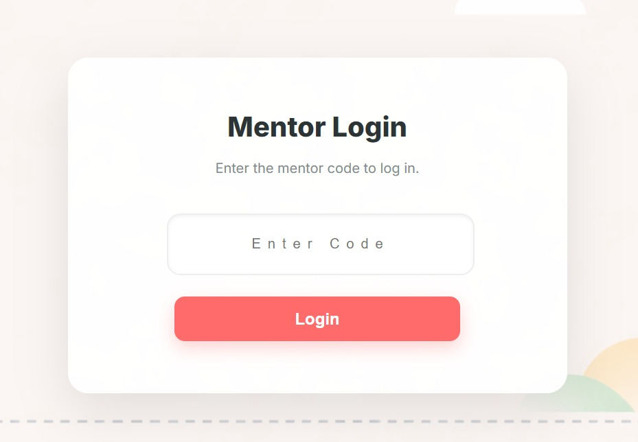
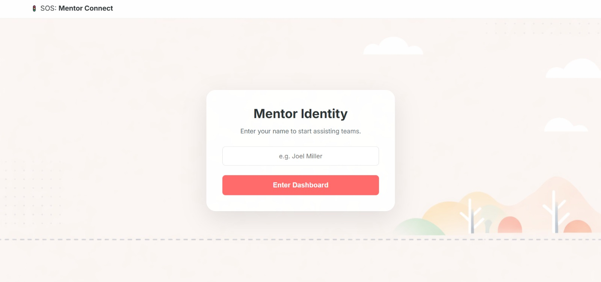
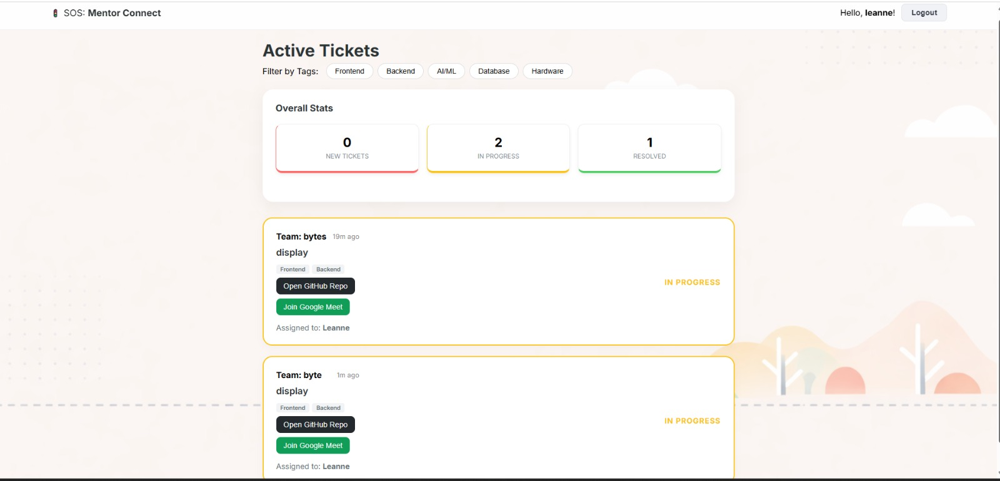

# SOS: Mentor Connect

## Project Description
SOS: Mentor Connect is a dual-interface dashboard designed to bridge the gap between struggling hackers and available mentors during high-pressure events. Students can submit help tickets with live code links, while mentors can filter, track, and preview issues in real-time without leaving their dashboard. The website is adapted for both online and offline versions of hackathon.

---

## Tech Stack
- **Frontend:** HTML, CSS, JavaScript
- **Backend/Database:** Firebase Realtime Database
- **Hosting/Deployment:** Firebase Hosting

---

## Features
1. Real-time ticket submission by student teams.
2. Mentor dashboard to view and accept tickets.
3. Tag-based filtering for tickets.
4. GitHub and Google Meet links for each ticket is needed.
5. Ticket status tracking: Waiting → In Progress → Resolved.
6. Automatic ticket sorting by arrival time.
7. Notification system for new tickets.

---

## Installation - Web App

1. Clone the repository
`git clone https://github.com/your-username/sos-mentor-connect.git`
2. Navigate to the project directory
3. Configure the Firebase
4. Open index.html in your browser or start Live Server

---

## Deployment
`npm install -g firebase-tools`
`firebase login`
`firebase init`
`firebase deploy`

---

## Architechture Diagram

---

## Data Documentation
The application utilizes a hierarchical NoSQL structure under a root node tinkherhack. This allows for efficient real-time listeners and secure access control.
1. Access Control
   `NodePath: /tinkherhack/`
   1. accessCodesUsed for simple authentication to distinguish between user roles during login.
      1. mentorCode: String — The passphrase required for Mentor access.
      2. studentCode: String — The passphrase required for Student access.
3. Tickets Node 
   `Path: /tinkherhack/tickets/{ticketId}`
   Each ticket is stored with a unique push ID generated by Firebase.KeyTypeDescription.
   * teamName : The name of the hackathon team
   * description : A brief summary of the technical issue.
   * tags : used for mentor filtering
   * githubLink : The repository URL used for the Live Code Preview feature
   * googleMeetLink: The virtual bridge for remote assistance.
   * status : Waiting, In Progress, or Resolved
   * acceptedBy : The name of the Mentor currently assigned to the team.
   * createdAt : timestamp (ms) for calculating wait times and sorting.

---

## Screenshots

### Home Page

### Student Login

### Student Page

### Student Waiting

### Student Ticket Accepted

### Mentor Login

### Mentor Identity

### Mentor Page

---

## Team Members

1. [Hannah Achu John](https://github.com/Hannah-Achu) - FrontEnd
2. [Leanne Roslyn Biju](https://github.com/leannebiju) - Firebase Integration

--- 

## License

This project is licensed under the **MIT License**. See the [LICENSE](LICENSE) file for details.

Copyright (c) 2026
